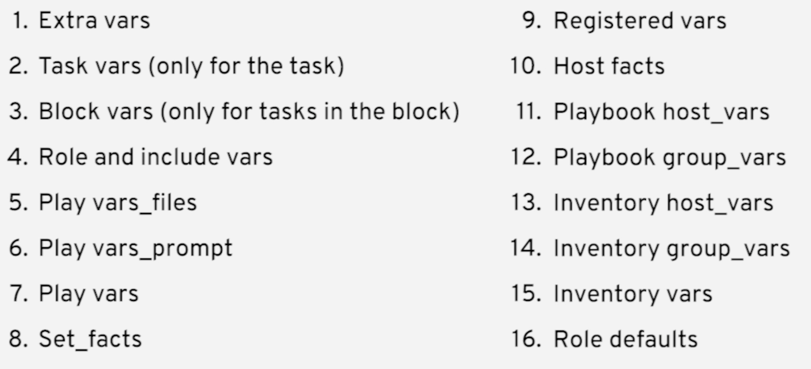
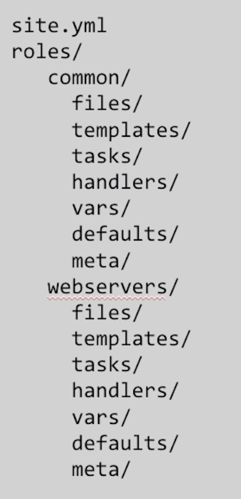
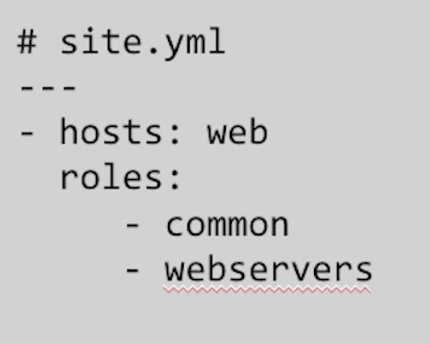

# Ansible

## What is Ansible?

Ansible is

* an IT automation tool. It can configure systems, deploy software, and orchestrate more advanced IT tasks such as continuous deployments or zero downtime rolling updates.
* an automation language that can describe an IT application infrastructure in Ansible playbooks.
* an automation engine that rus th playbooks

[more information...](http://docs.ansible.com/ansible/latest/index.html)

!!! info "Ansible tower"

    Ansible tower is an enterprise framework for controlling, securing and managing your Ansible automation with an UI and RESTful API.

## Why Ansible?

### Ansible is simple

* Human readable automation
* No special coding skills needed
* Tasks executed in order
* Get productive quickly
* Playbooks will run consitently accross the environments

### Ansible is powerful

* Application deployment
* Configuration management
* Workflow orchestration
* Orchestrate the application lifecycle

### Ansible is agent less

* Agentless architecture
* Uses OpenSSH and WinRM
* No agents to explot or update
* More efficent and more secure

### Ansible is cross platform

Agentless support for all major OS varients, physical, virtual, cloud and network

### Ansible works with existing toolkits

Homogenize existing environments by leveraging current toolsets and update mechanisms

### Ansible comes bundles with over 450 modules

### The most popular open source communities

## Install Ansible

```bash
# the most common way
pip install ansible

# install on RHEL/CentOS
sudo yum install ansible -y

# install on MacOS
brew install ansible -y
```

## How Ansible works?


## Playbooks are written in YAML

Tasks are executed which sequencially invokes Ansible modules

## Modules are "Tools in the Toolkit"

Python, Powershell, or any language  
Entend Ansible simplicity to the entire stack

!!! info "Modules : Run command"

    command: takes the command and executes it.

    shell: Executes through a shell like /bin/sh so that you can pipes etc.

    scripts: Runs a local script on a remote node after transferring it.

    raw: runs a raw command without going through the Ansible module subsystem.

## Inventory

Inventory is a collection of hosts (nodes) against which ansible can work with. Consists of hosts, groups and inventory-specific data (variables).

example:

```ini
[web]
webserver1.example.com
webserver2.example.com

[db]
dbserver1.example.com
```

The hosts can be represented as fully qualified webnames or IP addreses aswell.

## CMDB

Can be a custom CMDB or cloud (EC2, VMware, OpenStack, Azure, etc)

## Plugins are "Gears in the engine"

Code that plugs into the core engine  
Adaptability for various uses and platforms

## Variables

Ansible can work on metadata from various sources and manage their context in the form of variables.

### Variable precedence



## Tasks

Set of commands that run sequentially

## Handler Tasks

Handlers are special tasks that run at the end of a play if notified by another task.

if a configuration file gets changed notify a service restart start it needs to run.

## Plays and Playbooks

Plays are ordered set of tasks to execute against host selections from your inventory.

A playbook is a file containing one or more plays.

## Roles

Roles are packages of closely related Ansible content that can be shared more easily than plays alone.

Example role structure:



How to use roles in a playbook?



