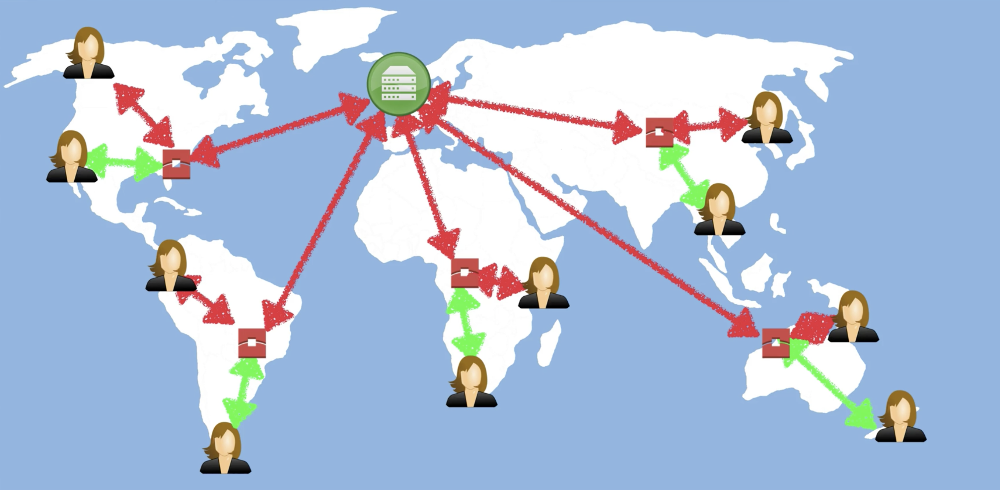

# Networking and content delivery

## VPC : Virtual Private Cloud

Amazon Virtual private cloud. Can be considered as a virtual datacenter.

Amazon Virtual Private Cloud (Amazon VPC) enables you to launch AWS resources into a virtual network that you've defined. This virtual network closely resembles a traditional network that you'd operate in your own data center, with the benefits of using the scalable infrastructure of AWS.

Configure firewall, availability zones, network sider address ranges,  Network ACL's, route tables etc.

## CloudFront

Amazons content delivery network service. A Content Delivery Network (CDN) is a system of distributed servers (network) that deliver webpages and other web content to a user base on the geogra[hic locations of the user, the origin of the webpage and a content delivery server.

!!! info "What is CDN?"
    

Amazons CloudFront can be used to deliver your entire website including dynamic, static, streaming and ineractive content using a global network of edge locations. Requests for your content are automatically routed to the nearest edge location, so content is delivered with the best possible performance.

### Key Terminology

* **Edge Location -** This is the location where content will be cached. This is separate to an AWS region or Availability zone.
* **Origin -** This is the origin of all the files that the CDN will distribute. This can be either an S3 Bucket, an Ec2 Instance, An Elastic Load Balancer or Route53.
* **Distribution -** This is the name given to the CDN which consists of a collection of Edge Locations.
    * **Web Distribution -** Typically used for websites
    * **RTMP -** Used for Media Streaming

!!! info

    * Amazon CloudFront also works with any non-AWS origin server, which stores the original, definitive versions of your files
    * Edge locations are not just READ only, you can write to them too
    * Objects are cached for the life of the TTL (Time To Live)
    * You can clear cached objects, but you will be charged
    * You can restrict view access using signed url's or signed cookies
    * You can create multiple origins per destribution
    * You can set restrictions based on Geo locations (Whitelist/Blacklist)

## Route 53

Amazons DNS service.

## API Gateway

For creating a serverless website.

A way of creating your own API for other services to talk to.

## Direct connect

Is a way of running a dedicated line from your Corporate head office or data center to AWS.