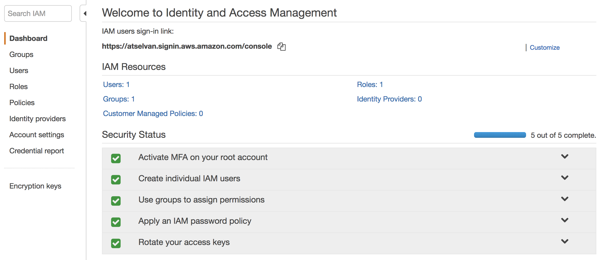

# Security, Identity and Compliance

## IAM [Identity and Access management]

IAM allows you to,

* manage users and their level of access to the AWS console
* have a centralised control of your AWS account
* have shared access to your AWS account
* configure granular permissions
* have identity Federation
* use multifactor Authentication
* provide temporary access for users/devices and services when necessary
* set up a custom password policies and password rotation policy

!!! info
    IAM supports PCI DSS Compliance

### IAM Management console

The IAM management console is global (its not specific to a region at this time) to the AWS environment and it allows you to manage all the benfits listed above. Its also list the security status of the AWS environment.

### Crtical terms

* **Users** - End Users
* **Groups** - A collection of users under one set of permissions
* **Roles** - You create roles and can then assign them to AWS resources
* **Policies** - A document that defines one or more permission. A policy can be attached to users, a group or a role. Policy documents are writen in JSON language.
* **Root account** - Root account is simply the email ID you use to sing-up to the AWS account. Root account gives you unlimited amount of access to the AWS account.

!!! info
    Always setup MFA (Multifactor Authentication) on your root account

When new users are created the have no access in the aws console. They are assigned a access key id, a secret key and a password (used for login in to the AWS console) which can be viewed only once during the creation of the user and cannot be retrived later, but can be generated again.

The access and security keys are not the same as the password and cannot be used to login to the AWS console. These are meant for accessing the AWS console from the API or a CLI. On the other hand a username and password cannot be used to access AWS via the API or CLI.

!!! info
    Power user role provides full access to AWS services and resources, but does not allow management of Users and groups.

## Cognito

Is a way of doing device authentication.Authenticate using FB, google etc.

Use Cognito as a authentication service to get temporary access to certain AWS resources.

## GuardDuty

It monitors for malicious activities on your AWS environment.

## Inspector

Installed on Virtual machines and EC2 instances to run a whole bunch of tests agains it to check for security vulnerabilities.

Can be scheduled to run weekly, monthly, etc.

Generates a report and gives you a severity report of the vulnerabilities.

## Macie

Will scan your s3 bucket to look for information that contain a personally identifiable information PII like names, adresses, passport numbers etc and alert you.

## Certificate Manager

Get ssl certificates for free if your using AWS services and registering the domains through route 53.

For Managing SSL certificates.

## CloudHSM – Secure Key Storage and Cryptographic Operations

HSM is short for Hardware Security Module. It is a piece of hardware — a dedicated appliance that provides secure key storage and a set of cryptographic operations within a tamper-resistant enclosure. You can store your keys within an HSM and use them to encrypt and decrypt data while keeping them safe and sound and under your full control. You are the only one with access to the keys stored in an HSM.

Each of your CloudHSMs has an IP address within your Amazon Virtual Private Cloud (VPC). You’ll receive administrator credentials for the appliance, allowing you to create and manage cryptographic keys, create user accounts, and perform cryptographic operations using those accounts. We do not have access to your keys; they remain under your control at all times. In Luna SA terminology, we have Admin credentials and you have both HSM Admin and HSM Partition Owner credentials.

Dedicated bits of hardware used to store your keys eg: private and public keys.

The keys may be used to access your EC2 instances. Can used these keys to encrypy AWS objects.

## Directory Service

A way of integration AD with AWS services.

## WAF : Web Application Firewall

Prevents cross site scripting, SQL injections etc. Prevents malicious users.

## Shield

Shield is basically DDOS mitigation.

## Artifact

For Audit and compliance. Way of downloading and inspecting Amazons documentations.
