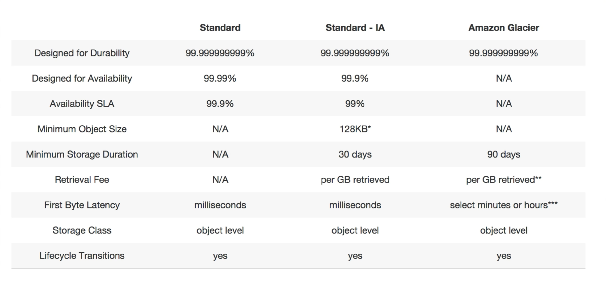

# Storage

## S3 [Simple storage service]

Amazon S3 is one of the oldest storages service on AWS and it provides access to secure, durable,reliable, fast, inexpensive and highly-scalable data storage infrastructure.

### S3 Basics

* S3 is a safe place to store your files
* It is a object based storage i.e. it allows you to upload files. Example: text files, videos, images, word files etc
* The data is spread across multiple devices and facilities
* Files can be from 0 Bytes to 5 TB
* There is unlimited storage
* Files are stores in buckets
* S3 is a universal namespace, that is, names must be globally unique
* Built for 99.99% availability
* Supports versioning
* Supports encryption
* Data can be secured using Access Control Lists and Bucket Policies

!!! info
    S3 is object based, you can install a operating system or a databse on it. The performance will be horrible.

    Successful uploads will generate a HTTP 200 status code

    By default buckets are private and all objects stored inside them are private

!!! faq "How does a S3 bucket URL look like?"
    ```https://s3-{region}.amazonaws.com/{bucket-name}```

### Data consistency Model

* Read after Write consistency for PUTS of new Objects. You will be able to read the data as soon as you upload it.

* Eventual Consistency for overwrite PUTS and DELETES (can take some time to propagate). Thus if you try to read updated data you either get the new data or the old data but the data is never currupted or incosistent.

### S3 is a simple key, value store

S3 is Object based and Objects consists of the following:

```properties
Key : The name of the object
Value : The data which is made up of a sequence of bytes
Version ID : for versioning
Metadata : Data about the data you are storing
Subresources
    Access Control List : Who can access this object. Allows you to do fine grain permission
    Torrent : Support for bit torrect protocol
```

### Storage Tiers/Classes

#### S3 - Standard

99.99% availability, 99.(11 x 9's)% durability, stored redundantly across multiple devices in multiple facilities and is designed to sustain the loss of 2 facilities concurrently.

#### S3 - IA (Infrequently Accessed)

For data that is accessed less frequently, but requires rapid access when needed. Lower fee than S3, but you are charged a retrieval fee (Per GB retrieved).

#### Reduced Redency Storage [RRS]

Designed to provide 99.99% availability and 99.99% durability of objects over a given year. Durability is less than S3 and cost is much lower than S3. Can be used to keep files that can be easily regenerated.

!!! example
    We can store the images in S3 bucket and the thumbnails in a RRS bucket. In the event the thunbnails are lost, they can be easily regenerated.

!!! info "Summary"

    

#### Glacier

Glacier is an entremely low-cost storage service for data archival. It stores data for as little as $0.01 per gigabyte per month and is optimised for data that is infrequently accessed and for which retrieval times of 3 - 5 hours are suitable.

!!! info "S3 vs Glacier"

    

### S3 - Encryption

* Client side encryption
* Server side encryption -
    * with Amazon S3 managed keys (SSE-S3)
    * with KMS (SSE-KMS)
    * with customer provided keys (SSE-C)

### S3 - Versioning

* Stores all versions of an object (including all writes and even if you delete an object)
* Great backup tool
* Once enabled versioning cannot be disabled, only suspended
* Integrates with lifecycle rules
* Versioning's MFA delete capability, which uses multi-factor authentication, can be used to provide an additional layer of security

### S3 - Charges

A S3 bucket is charged for:

* Storage
* Requests
* Storage Management Pricing - tagging data to track costs against a criteria
* Data Transfer Pricing - moving data within/between the S3 buckets
* Transfer accelaration

!!! faq "What is transfer accelaration?"
    Amazon S3 transfer accelaration enables fast, easy and secure transfers of files over long distances between the end users and the S3 bucket.

    Transfer accelaration takes advantage of Amazons CloudFront's globally distributed edge locations. As the data arrives at an edge location, data is routed to Amazon S3 over an optimized network path.

    

!!! faq
    [Amazon S3 FAQ](https://aws.amazon.com/s3/faqs/)

## EFS [Elastic file system]

Amazon EFS provides scalable file storage for use with Amazon EC2. You can create an EFS file system and configure your instances to mount the file system. You can use an EFS file system as a common data source for workloads and applications running on multiple instances.

Basically Network Attached storage. Can mount them to multiple virtual machines.

## Snowball

Move GB's of data to the Amazon data center without using broadband line or wifi. Write it phisically to a disk which is then moved to the data center of AWS.

## Storage gateway

AWS Storage Gateway is a hybrid storage service that enables your on-premises applications to seamlessly use AWS cloud storage. You can use the service for backup and archiving, disaster recovery, cloud bursting, storage tiering, and migration. Your applications connect to the service through a gateway appliance using standard storage protocols,such as NFS and iSCSI.