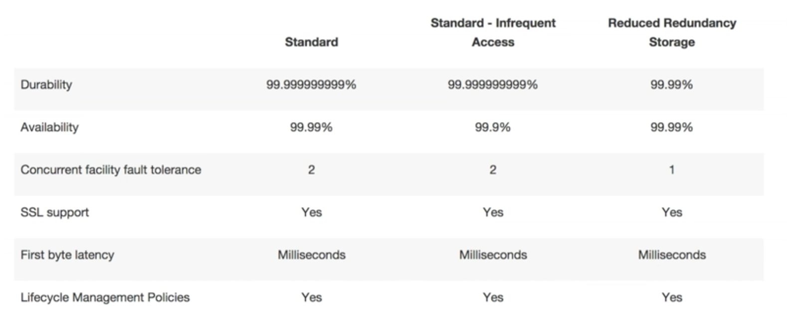

# Storage

## S3 [Simple storage service]

Amazon S3 is one of the oldest storages service on AWS and it provides access to secure, durable,reliable, fast, inexpensive and highly-scalable data storage infrastructure.

### S3 Basics

* S3 is a safe place to store your files
* It is a object based storage i.e. it allows you to upload files. Example: text files, videos, images, word files etc
* The data is spread across multiple devices and facilities
* Files can be from 0 Bytes to 5 TB. The largest object that can be uploaded in a single PUT is 5 gigabytes
* There is unlimited storage
* Files are stored in buckets
* S3 is a universal namespace, that is, bucket names must be globally unique
* Built for 99.99% availability
* Supports versioning
* Supports encryption
* Data can be secured using Access Control Lists and Bucket Policies
* You can load files to the S3 bucket much faster by enabling multipart upload

!!! info
    S3 is object based, it is not suitable to install a operating system or a databse on it

    Successful uploads will generate a HTTP 200 status code

    By default buckets are private and all objects stored inside them are private

!!! faq "How does a S3 bucket URL look like?"
    ```https://s3-{region}.amazonaws.com/{bucket-name}```

### Data consistency Model

* Read after Write consistency for PUTS of new Objects. You will be able to read the data as soon as you upload it.

* Eventual Consistency for overwrite PUTS and DELETES (can take some time to propagate). Thus if you try to read updated data you either get the new data or the old data but the data is never currupted or incosistent.

### S3 is a simple key, value store

S3 is Object based and Objects consists of the following:

```properties
Key : The name of the object
Value : The data which is made up of a sequence of bytes
Version ID : for versioning
Metadata : Data about the data you are storing
Subresources
    Access Control List : Who can access this object. Allows you to do fine grain permission
    Torrent : Support for bit torrent protocol
```

### Storage Tiers/Classes

#### S3 - Standard

99.99% availability, 99.(11 x 9's)% durability, stored redundantly across multiple devices in multiple facilities and is designed to sustain the loss of 2 facilities concurrently.

#### S3 - IA (Infrequently Accessed)

For data that is accessed less frequently, but requires rapid access when needed. Lower fee than S3, but you are charged a retrieval fee (Per GB retrieved).

#### Reduced Redundancy Storage [RRS]

Designed to provide 99.99% availability and 99.99% durability of objects over a given year. Durability is less than S3 and cost is much lower than S3. Can be used to keep files that can be easily regenerated.

!!! example
    We can store images in an S3 bucket and the thumbnails in an RRS bucket. In the event the thunbnails are lost, they can be easily regenerated.

!!! info "Summary"

    

#### Glacier

Glacier is an entremely low-cost storage service for data archival. It stores data for as little as $0.01 per gigabyte per month and is optimised for data that is infrequently accessed and for which retrieval times of 3 - 5 hours are suitable.

!!! info
    The Glacier storage class is designed for data that is retained for more than 90 days. Objects archived to Glacier storage class incur costs for atleast 90 days of storage even if they are deleted or overwritten earlier.

!!! info "S3 vs Glacier"

    

### S3 - Security

* By default, all newly created buckets are PRIVATE
* You can setup access control using:
    * Bucket Policies
    * Access Control Lists
* S3 buckets can be configured to create access logs, which log all requests made to the S3 bucket. These access logs can be stored to another bucket.

### S3 - Encryption

* In Transit:
    * SSL/TLS

* At Rest:
    * Client side encryption
    * Server side encryption -
        * with Amazon S3 managed keys (SSE-S3)
        * with KMS (Key Management Service) (SSE-KMS)
        * with customer provided keys (SSE-C)

### S3 - Versioning

* Stores all versions of an object (including all writes and even if you delete an object)
* Great backup tool
* Once enabled versioning cannot be disabled, only suspended
* Integrates with lifecycle rules
* Versioning's MFA delete capability, which uses multi-factor authentication, can be used to provide an additional layer of security
* You pay for each version of the object.

### S3 - Lifecycle Rules

Lifecycle rules will help you manage your storage costs by controlling the lifecycle of your objects. Create Lifecycle rules to automatically transition your objects to the S3-IA storage class, archive them to Glacier storage class and remove them after a specified time period.

* Can be used in conjunction with versioning. Versioning can be turned on or off.
* Can be applied to current versions and previous versions.
* You can setup the following options using Lifecycle rules:
    * Transition an object to the Standard - Infrequent Access storage class (128Kb and 30 days after the creation date)
    * Archive to Glacier storage class (30 days after IA, if relevant)
    * Permanently delete

### S3 - Cross Region Replication

* Versioning should be enabled on both the source and destination buckets
* Regions must be unique
* Files in an existing bucket are not replicated automatically. All subsequent updated files will be replicated automatically
* You cannot replicate to multiple buckets or use daisy chaining (at this time)
* Delete markers are replicated
* Deleting individual versions or delete markers will not be replicated.

### S3 - Static Websites

* You can use S3 to host static websites
* Serverless
* Very cheap, scales automatically
* Static only, cannot host dynamic sites.

!!! faq "How does a S3 static website hosting URL look like?"
    ```https://{bucket-name}.s3-website-{region}.amazonaws.com```

### S3 - Charges

A S3 bucket is charged for:

* Storage
* Requests
* Storage Management Pricing - tagging data to track costs against a criteria
* Data Transfer Pricing - moving data within/between the S3 buckets
* Transfer accelaration

!!! faq "What is transfer accelaration?"
    Amazon S3 transfer accelaration enables fast, easy and secure transfers of files over long distances between the end users and the S3 bucket.

    Transfer accelaration takes advantage of Amazons CloudFront's globally distributed edge locations. As the data arrives at an edge location, data is routed to Amazon S3 over an optimized network path.

    

!!! faq
    [Amazon S3 FAQ](https://aws.amazon.com/s3/faqs/)

## Snowball

Move GB's of data to the Amazon data center without using broadband line or wifi. Write it phisically to a disk which is then moved to the data center of AWS.

Snowball can:

* Import to S3
* Export from S3

There are three type of snowballs:

* Snowball - 80 TB Storage capacity
* Snowball Edge - 100 TB Storage + Compute capacity (mini version of an AWS datacenter in a box)
* Snowmobile - 100 PB per snow mobile

!!! info
    import/export service allows you to send your data in a disk to Amazon to be loaded into your S3 bucket.

## Storage gateway

AWS Storage Gateway is a hybrid storage service that enables your on-premises applications to seamlessly use AWS cloud storage. You can use the service for backup and archiving, disaster recovery, cloud bursting, storage tiering, and migration. Your applications connect to the service through a gateway appliance using standard storage protocols,such as NFS and iSCSI.

### Storage Gateway Types

#### File Gateway

Files are stored as objects in your S3 buckets, accessed through a Network File System (NFS) mount point.
Ownership, permissions and timestamps are stored in S3 metadata of the object associated with the file.

For flat files, stored directly on S3.


#### Volume Gateway

The volume interface presents your application with disk volumes using the iSCSI block protocol.

Data written to these volumes can be asynchronously backed up as point-in-time snapshots of your volume, and stored in the cloud as an Amazon EBS snapshots.

Snapshots are incremental backups that capture only changes blocks. All snapshot storage is also compressed to minimize your storage charges.

##### Stored Volumes

Entire dataset is stored on site and is asynchronously backed up to S3. The size of stored volumes can be 1 GB to 16 TB.

##### Cached Volumes

Entire dataset is stored on S3 and the most frequently accessed data is cached on-site. The size of cached volumes can be 1 GB to 32 TB.

### Tape Gateway (VTL)

Used for backup and uses popular applications like NetBackup, Backup Exec, Veeam etc.

!!! info "VTL - Virtual Tape Library"

## EFS [Elastic file system]

Amazon EFS provides scalable file storage for use with Amazon EC2. You can create an EFS file system and configure your instances to mount the file system. You can use an EFS file system as a common data source for workloads and applications running on multiple instances.

Basically Network Attached storage. Can mount them to multiple virtual machines.