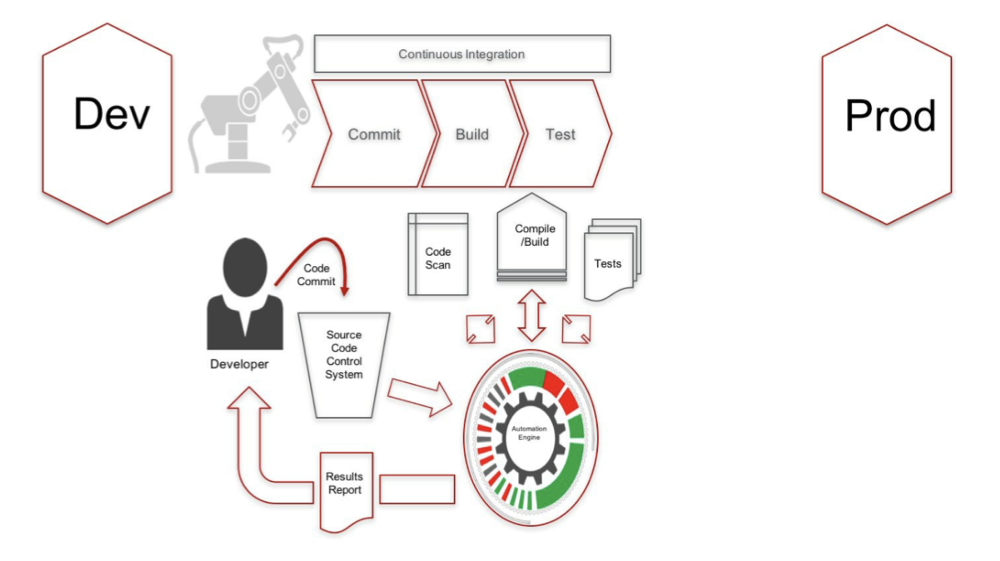
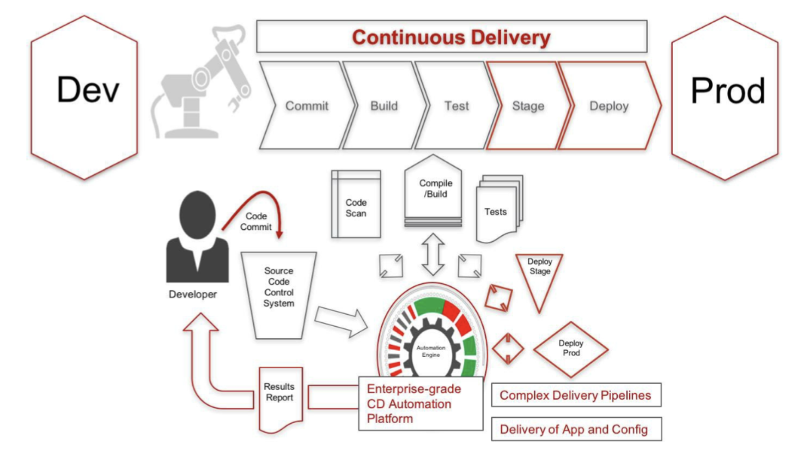
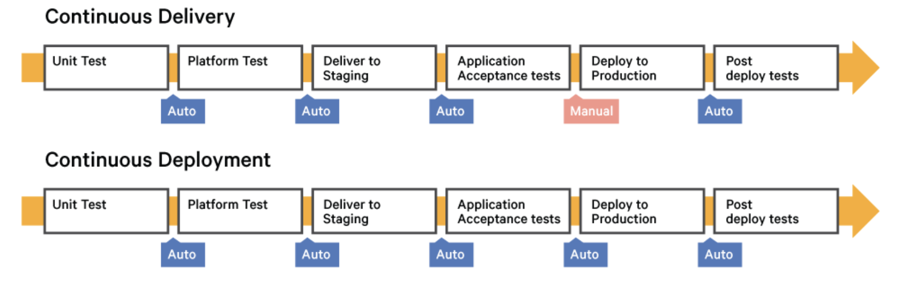

# CI/CD Fundamentals

## What is Continuous Intergration CI?

Continuous integration is a software development practice where members of a team integrate their work frequently

* Automate build and test executions of components
* Build very often (eg. per commit) to detectregressions quickly
* Test often (unit and integration tests)
* Automate regular code quality analysis exections

## What is Continuous Delivery?

* While CI lets you auomate the software build, scan and test process, CD automates the full application delivery pipeline taking new features and code from development to staging to production.
* CD is the ability to get new features, configuration changes, bug fixes into production or into the hands of the users safely and quickly in a sustainable way

## Continuous delivery vs continuous deployment

Continuous delivery is a series of practices designed to ensure that code can be rapidly and safely deployed to production by delivering every change to a production-like environment and ensuring business applications and services function as expected through rigorous automated testing. Since every change is delivered to a staging environment using complete automation, you can have confidence the application can be deployed to production with a push of a button when the business is ready.

Continuous deployment is the next step of continuous delivery: Every change that passes the automated tests is deployed to production automatically. Continuous deployment should be the goal of most companies that are not constrained by regulatory or other requirements.

While continuous deployment may not be right for every company, continuous delivery is an absolute requirement of DevOps practices. Only when you continuously deliver your code can you have true confidence that your changes will be serving value to your customers within minutes of pushing the "go" button, and that you can actually push that button any time the business is ready for it.

## CICD, Why do it?

* Make releases painless
* Reduce time to market
* Increase software quality and stability
* Reduce cost of ongoing software development
* Speed up the feedback loop

**_How long would it take to your organization to deploy a changes that involves just one line of code?_**

## _References_

1. [Cloudbees trainings](https://go.cloudbees.com/)
2. [Continuous delivery Vs continuous deployment](https://puppet.com/blog/continuous-delivery-vs-continuous-deployment-what-s-diff)