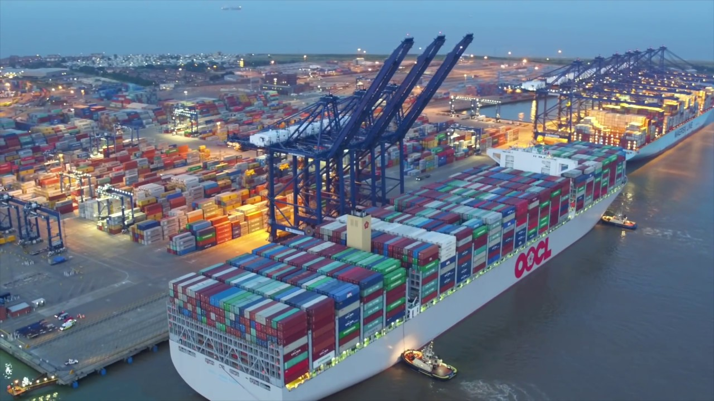

# Containers and Container Orchestration

## What are Containers?

Shipping containers are efficiently moved using different modes of transport – perhaps initially being carried by a truck to a port, then neatly stacked alongside thousands of other shipping containers on a huge container ship that carries them to the other side of the world. At no point in the journey do the contents of that container need to repacked or modified in any way.

Shipping containers are ubiquitous, standardized, and available anywhere in the world, and they're extremely simple to use – just open them up, load in your cargo, and lock the doors shut.

The contents of each container are kept isolated from that of the others; the container full of Mentos can safely sit next to the container full of soda without any risk of a reaction. Once a spot on the container ship has been booked, you can be confident that there's room for all of your packed cargo for the whole trip – there's no way for a neighboring container to steal more than its share of space.

Software containers fulfill a similar role for your application. Packing the container involves defining what needs to be there for your application to work – libraries, configuration files, application binaries, and other parts of your technology stack. Once the container has been defined, that *image* is used to create containers that run in any environment, from the developer's laptop to your test/QA rig, to the production data center, on-premises or in the cloud, without any changes. This consistency can be very useful: for example, a support engineer can spin up a container to replicate an issue and be confident that it exactly matches what's running in the field.

Containers are very efficient and many of them can run on the same machine, allowing full use of all available resources. Linux containers and cgroups are used to make sure that there's no cross-contamination between containers: data files, libraries, ports, namespaces, and memory contents are all kept isolated. They also enforce upper boundaries on how much system resource (memory, storage, CPU, network bandwidth, and disk I/O) a container can consume so that a critical application isn't squeezed out by noisy neighbors.

## Sounds a Lot Like a Virtual Machine (VM)?

There are a number of similarities between virtual machines (VMs) and containers – in particular, they both allow you to create an image and spin up one or more instances, then safely work in isolation within each one. Containers, however, have a number of advantages which make them better suited to building and deploying applications.

Each instance of a VM must contain an entire operating system, all required libraries, and of course the actual application binaries. All of that software consumes several Gigabytes of storage and memory. In contrast, each container holds its application and any dependencies, but the same Linux kernel and libraries can be shared between multiple containers running on the host. The fact that each container imposes minimal overhead on storage, RAM, and CPU means that many can run on the same host, and each takes just a couple of seconds to launch.

Running many containers allows each one to focus on a specific task; multiple containers then work in concert to implement sophisticated applications. In such microservice architectures, each container can use different versions of programming languages and libraries that can be upgraded independently.

Due to the isolation of capabilities within containers, the effort and risk associated with updating any given container is far lower than with a more monolithic architecture.

## Orchestration

Clearly, the process of deploying multiple containers to implement an application can be optimized through automation. This becomes more and more valuable as the number of containers and hosts grow. This type of automation is referred to as orchestration. Orchestration can include a number of features, including:

* Provisioning hosts
* Instantiating a set of containers
* Rescheduling failed containers
* Linking containers together through agreed interfaces
* Exposing services to machines outside of the cluster
* Scaling out or down the cluster by adding or removing containers