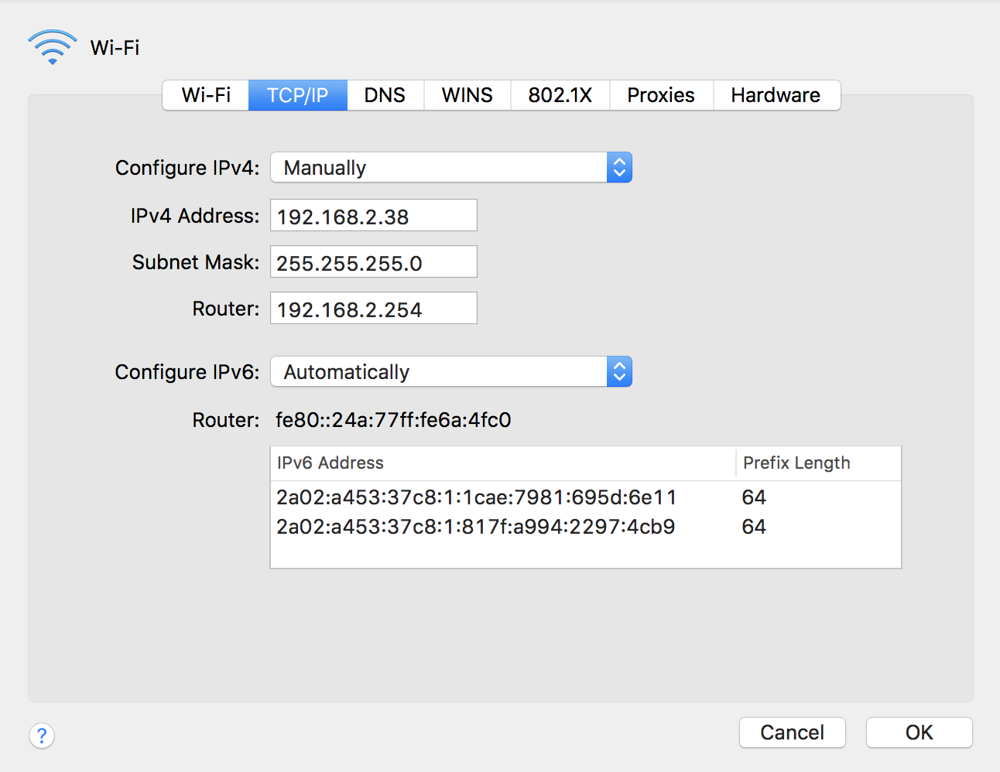
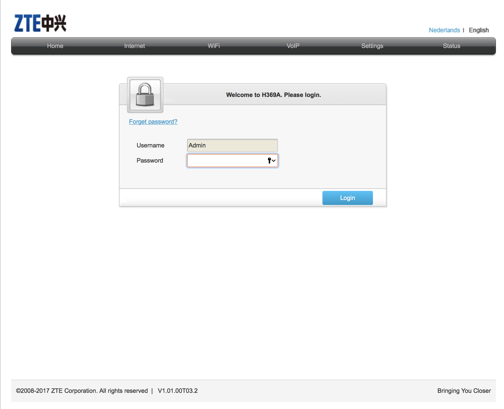
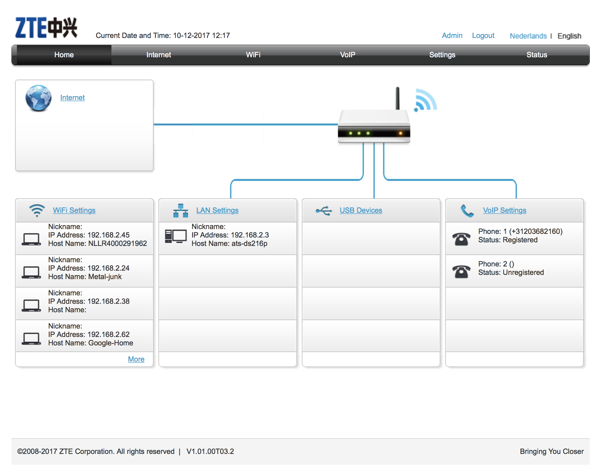
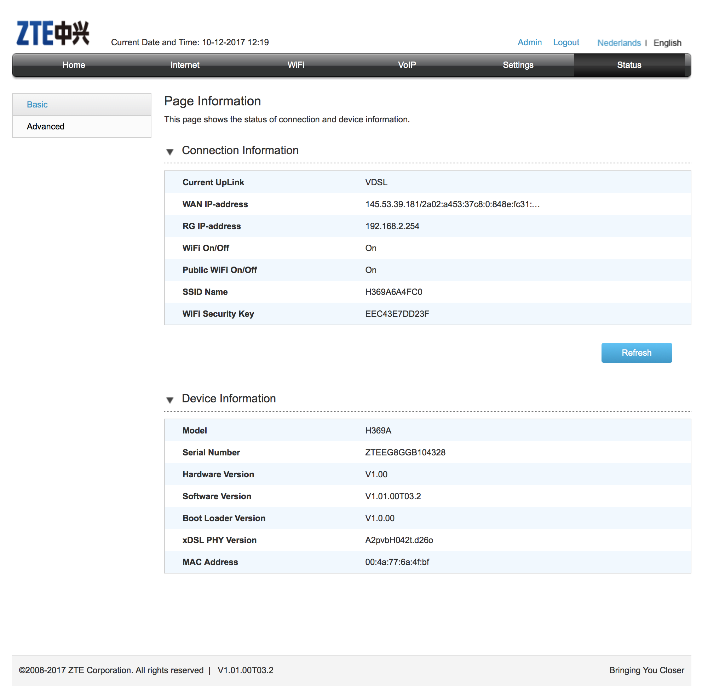
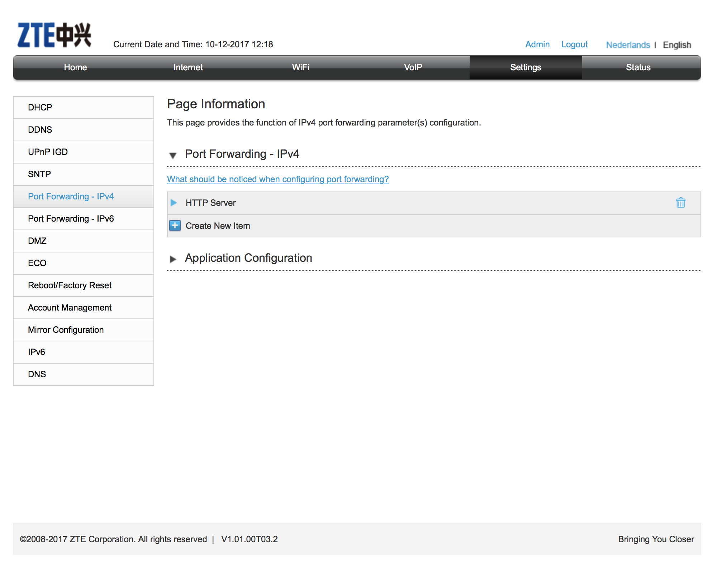
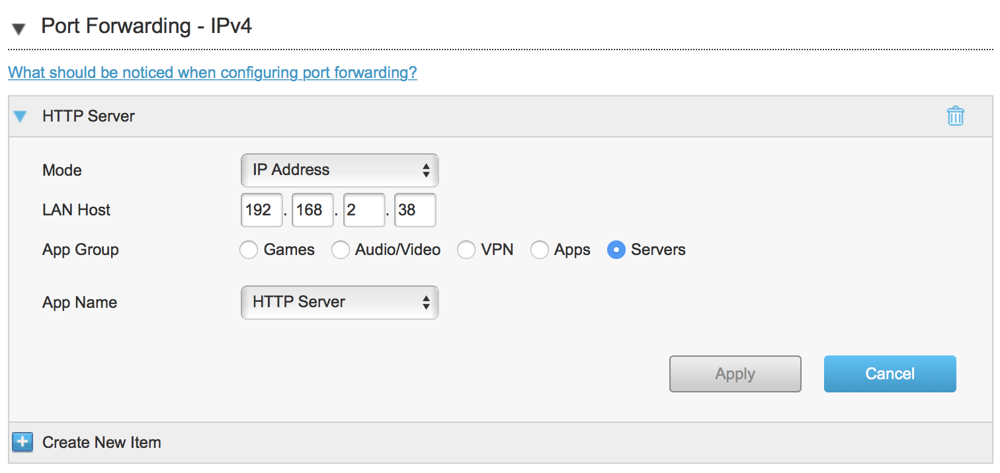
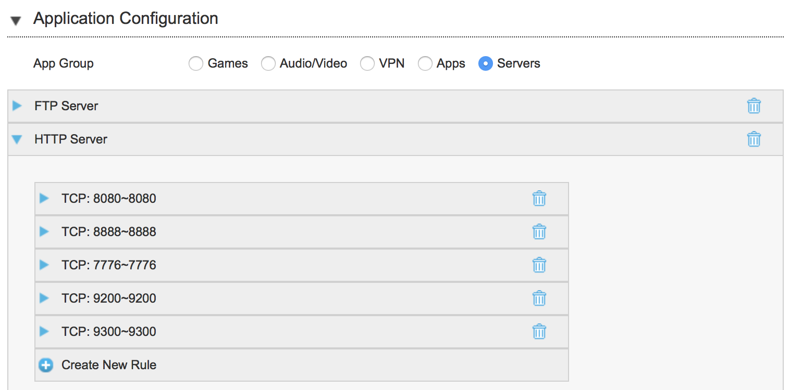

# How to host internet accessible website on your laptop

This document explains how to setup the router (ZTE H369A) for receiving the request on its public IP address and then forward the request to a computer (macbook) in the local network.

## Access router's software

Access your router software using a browser by entering its local IP address. You can find the local IP address using network details option in the connectivity of your laptop. The routers IP is the Default gateway address. (Mine is 192.168.2.254)

Once you access the routers IP you will be directed to the routers appliction login screen.

Provide the user name and password which generally is written at the bottom of the router or is “admin” for both entries. The steps you will take will vary according to the brand and model of your router but the process will be more or less the same. My router is the ZTE H369A, on which the default password is null. Thue the first login should be done leaving the password field empty. Make sure to set a strong password for security.

> This site provides steps for port forwarding for most of the Routers: https://portforward.com/router.htm

**Below steps will explain port forwarding settings for the ZTE H369A router:**

### Step 1: Find the public IP of the router

Click on the Status tab on the top navigation bar.
(If you will enter the WAN IP Address then you will see your router’s login page.)

### Step 2: Setup Port forwarding

Find the port forwarding settings under the Settings tab in the top navigation bar

Forward the traffic comming to the router on the desired IP and ports

### Step 3: Run a server program on your laptop

Run any application on your laptop on the port 8888 and 8080 and you will see the application is accessible via the public IP.

### Step 4: Register a domain and configure DNS for your public IP (Optional)

You can also register a domain on sites like goDaddy or others and point the domain to the public IP of your router (Which is your WAN IP).

I have registers a domain privatesquare.in and created a A record cicd.privatesquare.in on the domain settings to point to my WAN IP. Thus my webapp can be accessed on cicd.privatesquare.in:8080 from the public internet.

> PS: The webapp will only be accessible when my laptop is powered on!