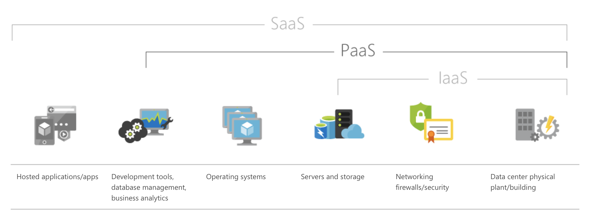

# Understanding IAAS, PAAS and SAAS

## Infrastructure As A Service

Infrastructure as a service (IaaS) is an instant computing infrastructure, provisioned and managed over the Internet. Quickly scale up and down with demand, and pay only for what you use.

IaaS helps you avoid the expense and complexity of buying and managing your own physical servers and other datacenter infrastructure. Each resource is offered as a separate service component, and you only need to rent a particular one for as long as you need it. The cloud computing service provider manages the infrastructure, while you purchase, install, configure, and manage your own software—operating systems, middleware, and applications.

## Platform As A Service

Platform as a service (PaaS) is a complete development and deployment environment in the cloud, with resources that enable you to deliver everything from simple cloud-based apps to sophisticated, cloud-enabled enterprise applications. You purchase the resources you need from a cloud service provider on a pay-as-you-go basis and access them over a secure Internet connection.

Like IaaS, PaaS includes infrastructure—servers, storage, and networking—but also middleware, development tools, business intelligence (BI) services, database management systems, and more. PaaS is designed to support the complete web application lifecycle: building, testing, deploying, managing, and updating.

PaaS allows you to avoid the expense and complexity of buying and managing software licenses, the underlying application infrastructure and middleware or the development tools and other resources. You manage the applications and services you develop, and the cloud service provider typically manages everything else.

## Software As A Service

Software as a service (SaaS) allows users to connect to and use cloud-based apps over the Internet. Common examples are email, calendaring, and office tools (such as Microsoft Office 365).

SaaS provides a complete software solution that you purchase on a pay-as-you-go basis from a cloud service provider. You rent the use of an app for your organization, and your users connect to it over the Internet, usually with a web browser. All of the underlying infrastructure, middleware, app software, and app data are located in the service provider’s data center. The service provider manages the hardware and software, and with the appropriate service agreement, will ensure the availability and the security of the app and your data as well. SaaS allows your organization to get quickly up and running with an app at minimal upfront cost.

## _References_

1. [Microsoft Azure documentation](https://azure.microsoft.com/en-us/overview/)
2. [IBM cloud learn](https://www.ibm.com/cloud/learn/iaas-paas-saas)