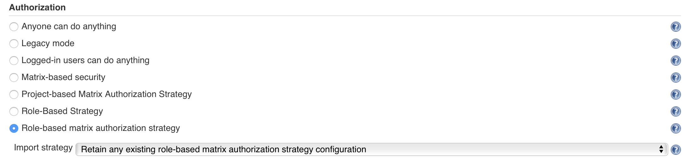

# Access control in Jenkins [RBAC]

## Introduction

The Role-based Access Control plugin in Jenkins gives a Jenkins administrator the ability to define various security roles that will apply to the system they administer. A role is chiefly a semantic construct forming the basis of access control policy. Once roles have been defined, the Jenkins administrator can assign those roles to groups of users. The assignment of roles can take place either at the global level or can be limited to specific objects within the system. Additionally, the Jenkins administrator can even delegate the management of groups for specific objects to specific users.

The Role-based Access Control plugin combines with the Folders plugin to provide a powerful solution for managing a Jenkins installation that is shared by multiple teams of users. The Jenkins administrator can create folders for each of the teams and then create groups in those folders for each of the roles that team members are assigned. By delegating the management of the group membership (but not the management of the roles assigned to groups) to the team leaders, the Jenkins administrator can empower the team leads to manage the permissions of their team, while reducing the administrative overhead.

## RBAC in Jenkins

Role based access control can be configured as an authorization policy via the Manage Jenkins -> Configure Global Security

### RBAC allows

* Creation of re-usable global and object-only roles.
* Roles define very granular permissions on all CJOC objects (client masters, shared agents, update center) as well as traditional Jenkins objects (jobs, folder, view, etc.)

Roles that are created must be mapped to groups defined in Jenkins. These groups can be "shadow" groups for external groups in LDAP/AD.

CloudBees RBAC supports very granular permissions for roles.
e.g. "user" role only has overall read permissions while "developer" role supports read/wrtie/execute permissions on jobs only in a given folder

### Getting started with RBAC

* Ensure that the role-based access control plugin is available in the Jenkins instance (The plugin come by default in an enterprised Jenkins/JOC instance).
* Ensure security is turned on and a valid security realm has been selected.
* Opt to use "role-based matrix authorization strategy" to enable CloudBees Role-Based Access Control plugin as your  authorization policy.
* Jenkins will automatically setup RBAC with some default roles and will authenticate you as the system admin of the instance. Note that any previous access control configuration will be revoked and at this moment except you no one will have access to the Jenkins instance.
* Once RBAC is activated on the instance you will get additional links on the left navigation pannel for managing Roles and Groups.
* Create groups and roles on your CJOC instance and assign roles to these groups.
* Add users/external groups to the Jenkins groups.
* Opt to have CJOC push security realm/authorization to client masters.

### Role definitions

* **administrator** : The administrator role has all the privileges

* **user** : The user role has the privilege to login to Jenkins to a blank Jenkins UI.

`
PS: Without the Job/Create privilege being assigned to the user role at the root level users will not be able to create items inside their folders as well, hence this privilege is granted.
`

* **dev-user** : This role has a slightly elevated privilege than the user role to build jobs etc.

* **reviewer** : The review role grants a user view access on all the items that are available in Jenkins for review purpose.

* **node-manager** : The node-manager roles grants a user access to manage the nodes/agaents/buildslaves added in Jenkins.

* **reader** : The reader role grants a user read access on the content(s). This role is intended to be used at a folder level.

* **developer** : The developer role grants a user access to create, build and manage items in a Jenkins folder.