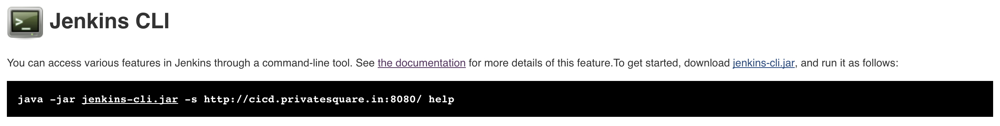

# Jenkins Command Line Interface (CLI)

## Getting Started

Go to Manage Jenkins -> Jenkins CLI

-s option : sets Jenkins to connect to

This page will give you a link to download the cli compatible with the version of jenkins you are using and will list all the available commands.

## How it works

CLI makes an HTTP call to Jenkins, discovers the port
CLI attempts to open TCP/IP connection
If it fails, fall back to HTTP-based connection

Command execution happens on the master
But sometimes code gets downloaded
Therefore, one CLI jar can be used to talk to different masters

## Groovy in CLI

Use “groovy” command to run a pre-authored script file
See https://github.com/jenkinsci/jenkins-scripts for scripts other people wrote

Useful reference:
http://javadoc.jenkins-ci.org