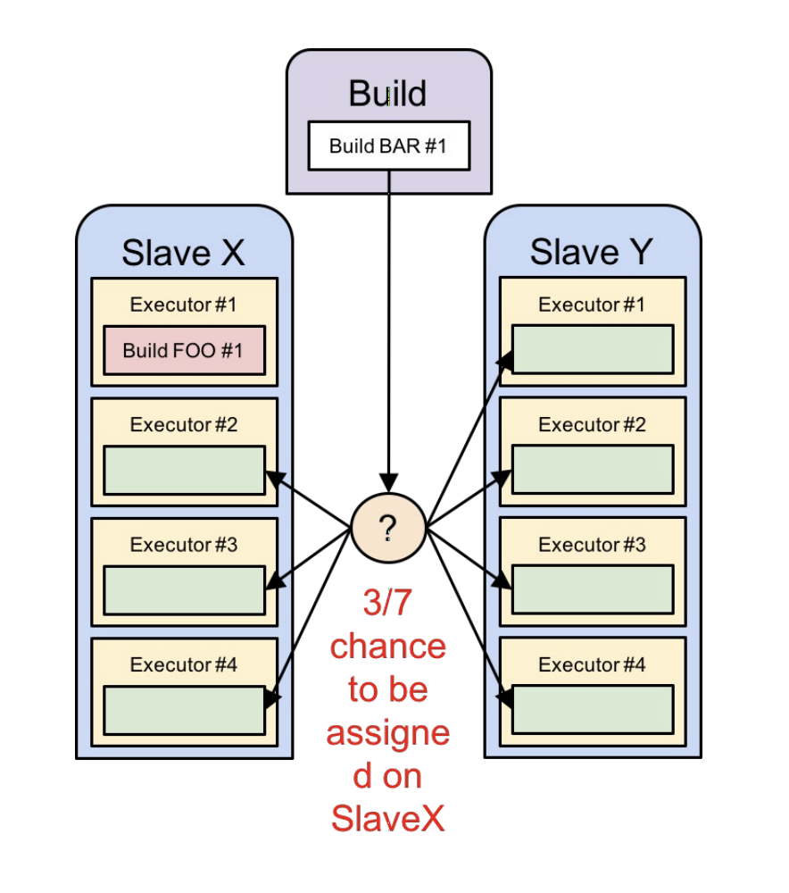
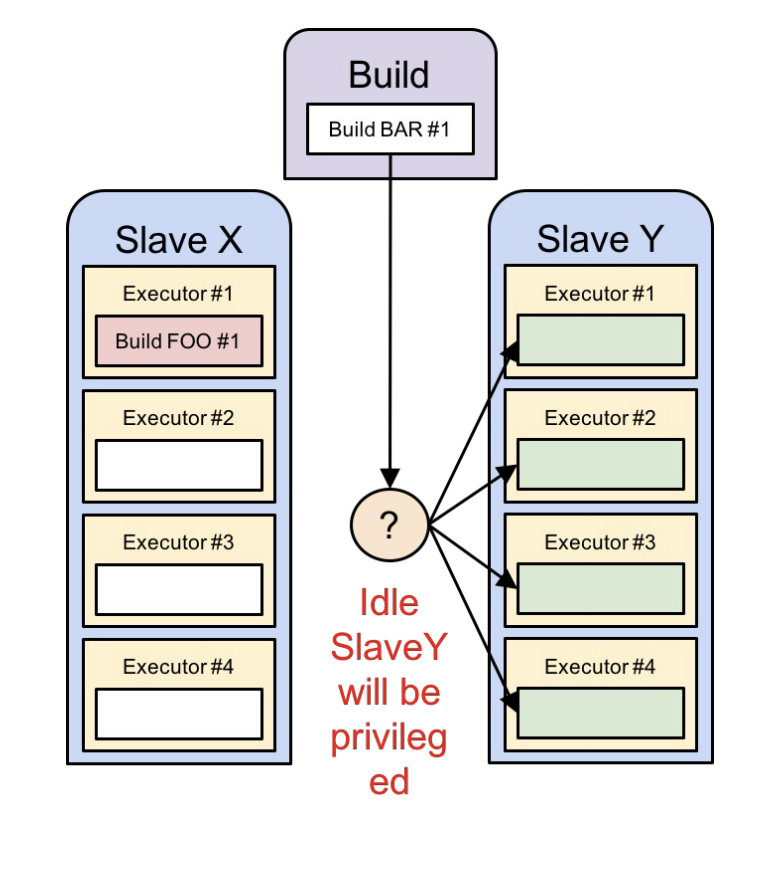
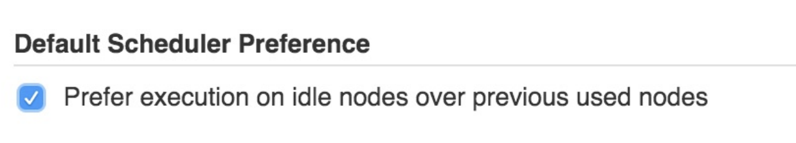
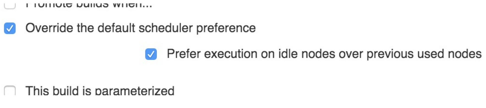

# How does Jenkins decide where to run any give build?

When using many agent nodes, Jenkins needs to decide where to run any given build. This is called scheduling.

In Jenkins node selection is done in 2 steps:

1. Filter nodes where the build can be executed.
2. One node amongst all the qualifying nodes in (1) must be selected to carry out the build. While (1) is processed by Jenkins core, (2) can be customized by a plugin: this is what the even scheduler plugin does.

## Consistent hashing algorythm - Default Jenkins Behavior

From a the user point of view:
Jenkins tries to always use the same node for the same job. If not available, it’ll build elsewhere but comes back to preferred one as soon as it is available

From a the technical point of view:
Jenkins creates a priority list for each job that lists all the agents in their preferred order, then picks the most preferred available node. Technically: hashes the name of the node and the job name to create a probe point for
the consistent hash.

Assumption:
Based on the assumption that it is preferable to use the same workspace as much as possible:
because SCM updates are more efficient than SCM checkouts.
with many jobs, this tends to keep the number of the workspaces on each node small.
some build tools (such as Maven and RVM) use local caches, and they work faster if Jenkins
keeps building a job on the same node

Cons/Downside of this strategy:
Jenkins doesn’t try to actively create balanced load on nodes
Example:
Build FOO #1 running on agent X
3/7 chance BAR #1 still gets assigned to X

## Even loading algorythm

The even scheduler plugin offers a different scheduling algorithm, known as even loading strategy. Under this strategy, the scheduler prefers idle nodes absolutely over nodes that are doing something. With this algorithm, the total capacity of the system does not change—only the order in which the available capacity is filled.

Back to our example:
BAR #1 will always run on Y, because X is currently building FOO #1
Even though it still has 3 idle executors, it will not be considered so long as there are other
qualifying agents that are completely idle.

Benefits: Efficiency
Even loading is most useful for jobs which are slow to build, but for which the very first build on a node is not notably slower than any other. You are more likely to get a fully idle node Executing a build on a fully idle system is faster than executing the same thing on a partially loaded system, all else being equal. But if the node does not have a workspace already initialized for this job, you’ll pay the price of fully checking out a new copy, which can cancel other performance gains.

## Getting started

`Check if the plugin is installed. If not [download](https://release-notes.cloudbees.com/product/11) and install the plugin or install from the jenkins update center.`

Global preference: Picks the scheduling algorithm globally for all jobs, unless specifically overridden by
individual jobs.

* Go to Manage Jenkins -> Configure System and find the Default Scheduler Preference option to set the global preference.
* Select Prefer execution on idle nodes over previous used nodes

Per-job preference: Picks the scheduling algorithm for a specific job, regardless of the global preference.

* Go to the configuration screen of a job
* Select Override the default scheduler preference
* Select Prefer execution on idle nodes over previous used nodes

