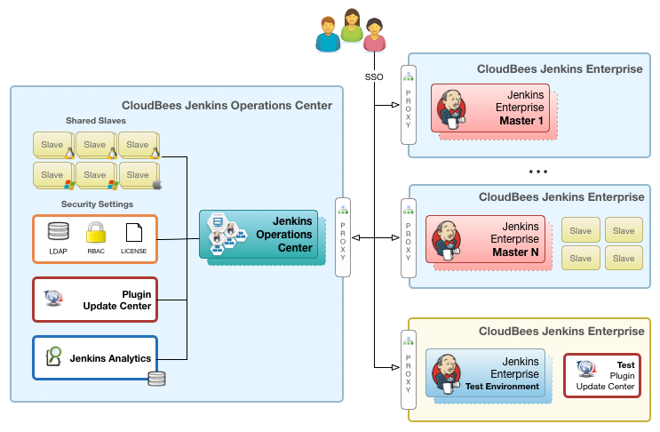

# Jenkins

Jenkins orchestrator that offers a simple way to set up a [continuous integration](http://docs.privatesquare.in/blog/cicd-fundamentals/#what-is-continuous-intergration-ci) or [continuous delivery](http://docs.privatesquare.in/blog/cicd-fundamentals/#what-is-continuous-delivery) environment for almost any combination of languages and source code repositories using pipelines, as well as automating other routine development tasks. While Jenkins doesn’t eliminate the need to create scripts for individual steps, it does give you a faster and more robust way to integrate your entire chain of build, test, and deployment tools than you can easily build yourself.

## Cloudbees Jenkins Platform (CJP) reference architecture

