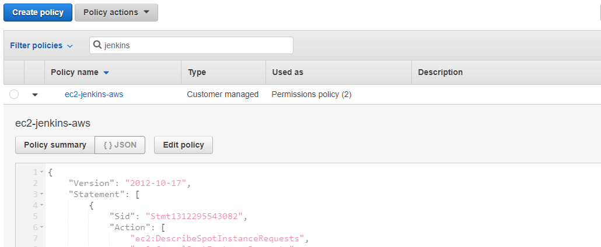
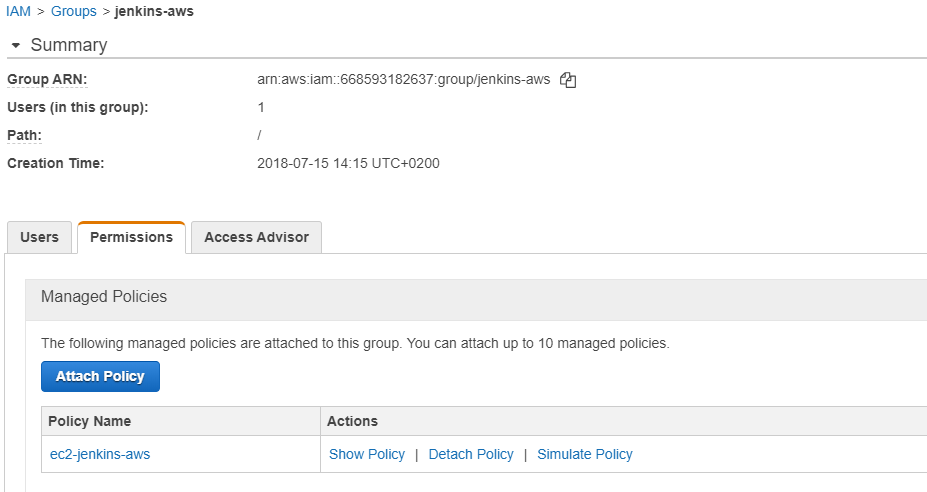
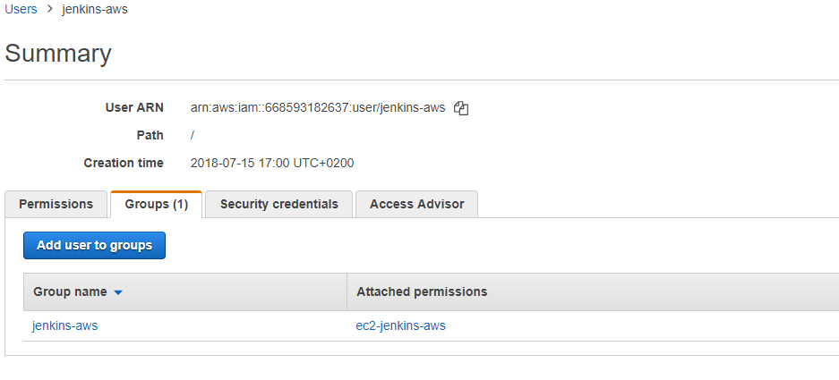
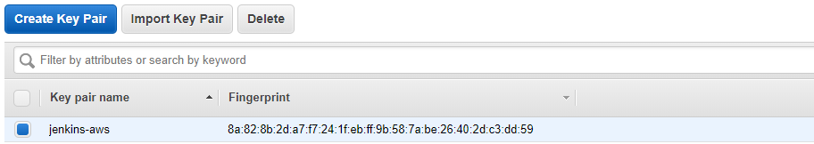
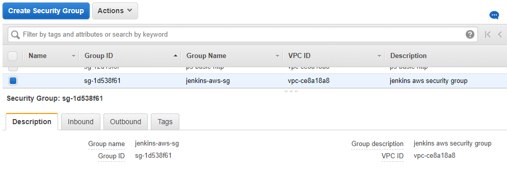
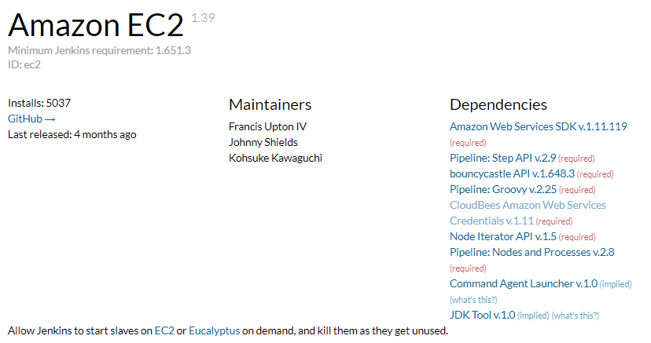
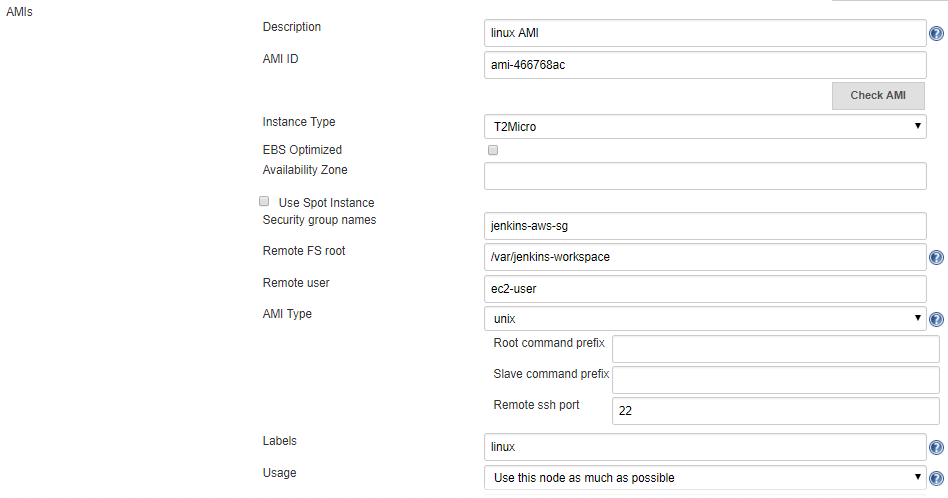
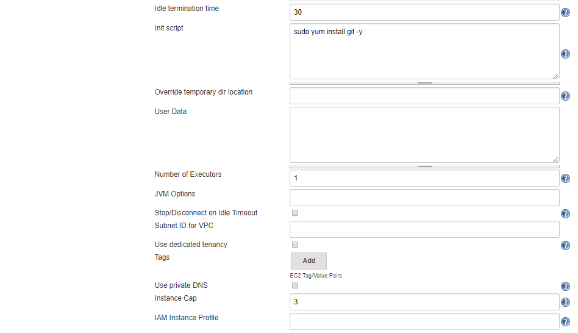
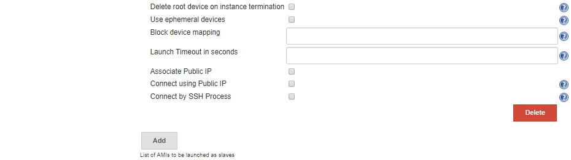

# Running Dynamic Jenkins slaves on AWS

If you are a Jenkins Administrator and you are maintaining a Jenkins cluster in a on-premise infrastructure you may have noticed that maintaining Jenkins slaves can becomes a painful task in the long run. A long list of development tools to be installed, multiple teams building on the same slave leading to one build affected by another, cleaning up the slaves, etc etc. the list can go on. There are some of the activities and maintenance tasks that you would have to do on all the slaves.

When more capacity is required more slaves are added to the list, which increases the maintenance tasks by the number of new slaves that are added to the cluster.

In the cluster we manage, there is currently 1 CJOC instance, 10 Jenkins Masters and 64 slaves running two services each. We created all sorts of provisioning scripts and cleanup scripts to make sure the slaves are provisioned and configured identically and also function as required. But this is not easy to manage. Also the slave are always online even though there are no build running on these machines.

The Jenkins EC2 plugin can be of great help in such scenarios. With this plugin and an AWS account a Jenkins Master can dynamically create new slaves using a configurable AMI. The AMI can be created with all the required build tools already installed in it or the inline scripts space in the plugin configuration could be used to install the build tools on the slave. Im more capacity is required automatically new slaves will be created and if the slaves are idle for a configured amount of time the machines will be automatically either stopped or terminated (based on your configuration). Thus the setup is also cost efficient.

Below steps explain how the Amazon EC2 plugin can be setup in a Jenkins Master.

!!! note

    Below steps assume that you already have a AWS account and that you have a basic overview of the IAM and EC2 services of AWS and of Jenkins.

## 1. Create a Policy

Create a policy in AWS to manage the permission for the user which will be created in the next steps. The policy definition is mentioned below:

```json
{
    "Version": "2012-10-17",
    "Statement": [
        {
            "Action": [
                "ec2:DescribeSpotInstanceRequests",
                "ec2:CancelSpotInstanceRequests",
                "ec2:GetConsoleOutput",
                "ec2:RequestSpotInstances",
                "ec2:RunInstances",
                "ec2:StartInstances",
                "ec2:StopInstances",
                "ec2:TerminateInstances",
                "ec2:CreateTags",
                "ec2:DeleteTags",
                "ec2:DescribeInstances",
                "ec2:DescribeKeyPairs",
                "ec2:DescribeRegions",
                "ec2:DescribeImages",
                "ec2:DescribeAvailabilityZones",
                "ec2:DescribeSecurityGroups",
                "ec2:DescribeSubnets"
            ],
            "Effect": "Allow",
            "Resource": "*"
        }
    ]
}
```



## 2. Create a Group

Once you have created a policy, create and group and assign the jenkins-aws policy created in step 1 to the group.



## 3. Create a user

Create a user in your AWS account and add the user to the jenkins-aws group creted in step 2. The user should have programatic access to the AWS account. The user will be only able to perform the activities that are allowed by the jenkins-aws policy.

!!! note

    Make sure you have saved the Access Key ID and the Secret access key for the user because this needs to be saved in the jenkins credentials manager.



## 4. Create a key-pair

Create a key-pair to enable Jenkins to use this key to ssh and configure the Ec2 instances as slaves. 

!!! note

    Again do not forget to download the pem file and save it as it has to be configured in Jenkins.



## 5. Create a security group

Create a security group to define the input output connections to the EC2 instances.



## 6. Install the Amazon EC2 plugin in Jenkins

[Download](https://github.com/jenkinsci/ec2-plugin/releases) and install the Amazon EC2 plugin in your Jenkins instance. You can also use the Jenkins plugins manager for installing the plugin.



## 7. Configure the Plugin

First configure the access key Id and secret access key of the user created in step 3 as aws credentials in the Jenkins credentials manager.

To configure the plugin go to `Manage Jenkins -> Configure System` and then search for the cloud option (This is normally at the end of the config page). follow the below images for the configuration.


Once you give a `Name` and select the `Amazon EC2 credentials` the `Region` dropdown should load automatically. If this is not the case then there is some issue with either creation of the user account or in saving the credentials in jenkins or it can be a network issue between your Jenkins instance and your AWS account. 

The `EC2 Key Pair's Private Key` will be the key you saved in step 4.

You can also verify the connection using `Test Connection` option.

Next, configure the AMI you would like to use for the slaves. Mention the security group created in step 5 in the AMI configuration.





!!! info

    You can configure multiple AMI's here with different labels based on your requirements.

Once you have configured the plugin just build some jobs and see the magic!!